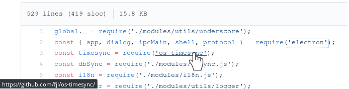

# github-module-links

This userscript inserts direct repository links for modules used in source code on github. Currently only JS & npm are supported.

Repo URLs are being fetched from [npmjs registry](https://registry.npmjs.org/). Relative imports are also linkified.

Check the source code for configurable options.

# Installing

Follow the [userscript installation instructions](https://github.com/OpenUserJs/OpenUserJS.org/wiki/Userscript-Beginners-HOWTO#how-do-i-get-going).

The file is located [here](https://github.com/8084/github-module-links/raw/master/build/github-module-links.user.js).

# TODO

- find more elegant way to listen for page content changes than `setInterval` with checker function (defeat that ugly AJAX navigation)
- DONE ~~add support for `import something from 'some-module'` notation~~
- replace system modules with links to their sources instead of [security-holder](https://github.com/npm/security-holder/) module
- process repository URLs more carefully (consider rare cases when `repository.type` is not `git`, etc.)
- consider adding more programming languages and package registries